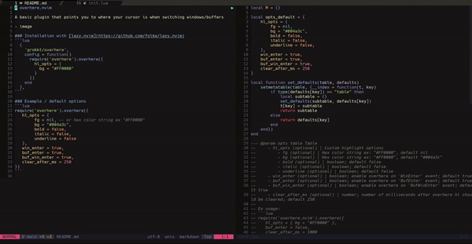

# overhere

Make your cursor say "hey I'm over here" when switching between buffers/windows



### Installation with [lazy.nvim](https://github.com/folke/lazy.nvim)
```lua
  {
    'grokkt/overhere',
    config = function()
      require('overhere').setup({
        hl_opts = {
          bg = "#FF0000"
        }
      })
    end
  },
```

### Example / default options
```lua
require('overhere').setup({
   hl_opts = {
        fg = nil, -- or hex color string ex "#FF0000"
        bg = "#004a3c",
        bold = false,
        italic = false,
        underline = false
   },
   win_enter = true,
   buf_enter = true,
   buf_win_enter = true,
   clear_after_ms = 250
})
```

